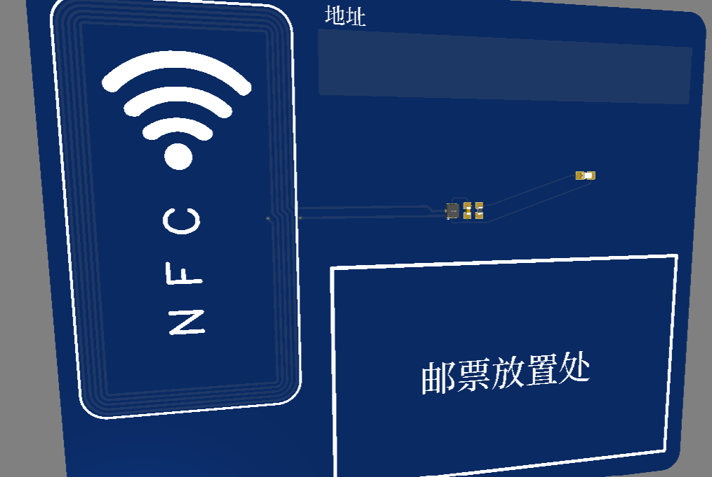

# nfc-card
A simple Postcard(Business Card) with NFC function

Designed by EasyEDA.
BOM:
a red LED-0603
one 47kΩ-0402
one220nF-0402
one NT3H1101W0FHKH chip
## reference:
https://oshwhub.com/yang-z-b/nfc-card
https://www.instructables.com/PCB-Business-Card-With-NFC/
